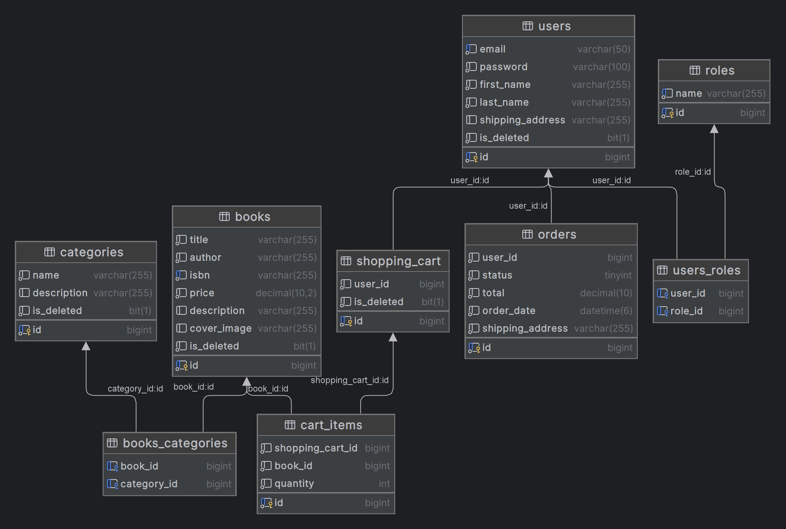

# Book Store Application   

Online Book Store is an application that provides functionality for management book sales 
and purchases. As a customer you can register and log in, search for books by id, categories
and specific filters, add some to your shopping cart and place an order. As an admin you can
add/update/delete new books, manage statuses of orders, add a role for users.  

## Navigation   

* [Features](#features-)   
* [Technologies](#technologies-)   
* [Entities](#endpoints-)   
* [Endpoints](#endpoints-)  
* [Class diagram](#class-diagram)
* [Try it yourself](#try-it-yourself-)

  
## Features:   

### **User:**   

* register in app   
* log in (using username (email) and password) to search for books, choose some and place an order   

#### Book searching:   
* view all books  
* find exact book by id  
* search books by specific category   
* search books by specific author  
* search books by title  

#### Book management:  
* add books to shopping cart  
* view your shopping cart  
* update quantity of books in shopping cart   
* delete a book from shopping cart   

#### Order management:   
* place an order (with items that are in shopping cart)   
* get all orders   
* get all order items of some order (by id)    
* get order item by id    

### Admin:  

**Now if you need an admin role, you can log in via these credentials:**  
email: `admin@example.com`     
password: `example1234`  

* register in app  
* log in using username (email) and password  

#### In addition, you can:  

#### Book management:  
* create new book  
* update existing one  
* delete book  

#### Category management:  
* create new category  
* update existing one  
* delete category  

#### Order management:  
* update a status of an order  

#### Role management:  
* update user's role by user id and roles ids  

[back to navigation](#navigation-)  

  
## Technologies  

* **Programming language:** Java 17  
* **Spring Framework:** Spring Boot v3.1.5, Spring Data, Spring Security v6.1.5 (Authentication using JWT token)  
* **Database Management:** MySQL 8.0.33, Hibernate, Liquibase v4.20.0  
* **Additional instruments:** Maven, Lombok, Mapstruct  
* **Documentation:** Swagger

[back to navigation](#navigation-)  

  
## Entities:  

1. **User** - represents any user  
2. **Role** - represents user's role in app (user or admin)  
3. **Book** - represents any book  
4. **Category** - represents book's category (e.g. "Horror", "Fiction")  
5. **CartItem** - represents an item in shopping cart  
6. **Shopping cart** - represents user's shopping cart  
7. **OrderItem** - represents an item in user's order  
8. **Order** - represents user's order  

[back to navigation](#navigation-)  

  
## Endpoints:  

### Authentication Controller:  

POST: /auth/register - register a new user     
POST: /auth/login - login registered user  
POST: /auth/{userId} - update user's role `admin only`  

### Book Controller:  

POST: /api/books - create new book  `admin only`       
GET: /api/books - get a list of all books  
GET: /api/books/{id} - get exact book by id  
PUT: /api/books/{id} - update a book by id `admin only`  
DELETE: /api/books/{id} - delete a book by id `admin only`  

### Category Controller:  

POST: /api/categories - create a new category `admin only`  
GET: /api/categories - get a list of all categories  
GET: /api/categories/{id} - get a category by id  
GET: /api/categories/{id}/books - get a books of exact category by category id  
PUT: /api/categories/{id} - update category by id `admin only`  
DELETE: /api/categories/{id} - delete category by id `admin only`  

### Shopping Cart Controller:  

GET: /api/cart - get user's cart  
POST: /api/cart - add a book to shopping cart  
PUT: /api/cart/cart-items/{cartItemId} - update a quantity of books in shopping cart  
DELETE: /api/cart/cart-items/{cartItemId} - delete an item from shopping cart  

### Order Controller:  

POST: /api/orders - place an order with items in shopping cart   
GET: /api/orders - get a list of all orders  
GET: /api/orders/{orderId}/items - get an exact order by id  
GET: /api/orders/{orderId}/items/{itemId} - get an exact order item by id  
PATCH: /api/orders/{id} - update a status of an order `admin only`  

[back to navigation](#navigation-)

## Class diagram

[back to navigation](#navigation-) 

## Try it yourself  

How to launch project on Docker:

1. Install [Docker](https://www.docker.com/products/docker-desktop/)   
2. Clone repository from [GitHub](https://github.com/anastasiia-fi/book-store)  
3. Add your properties to .env file (`.env.sample` as an example)
4. Run `mvn clean package`  
5. Open docker app    
6. Run `docker-compose build` , and then `docker-compose up`    
7. Test application in swagger - add this after your host and port `/swagger-ui/index.html#/`

[back to navigation](#navigation-)   